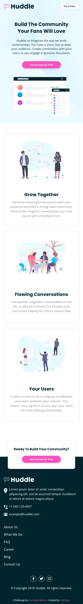

# Frontend Mentor - Huddle landing page with alternating feature blocks solution

This is a solution to the [Huddle landing page with alternating feature blocks challenge on Frontend Mentor](https://www.frontendmentor.io/challenges/huddle-landing-page-with-alternating-feature-blocks-5ca5f5981e82137ec91a5100). Frontend Mentor challenges help you improve your coding skills by building realistic projects. 

## Table of contents

  - [Overview](#overview)
    - [The challenge](#the-challenge)
    - [Links](#links)
    - [Screenshots](#screenshots)
  - [My process](#my-process)
    - [Built with](#built-with)
    - [Useful resources](#useful-resources)
  - [Author](#author)

## Overview

### The challenge

Users should be able to:

- View the optimal layout for the site depending on their device's screen size
- See hover states for all interactive elements on the page

### Links

- [GitHub repo](https://github.com/Farhaan9082/huddle-landing-page)
- [Live Site URL](https://farhaan9082.github.io/huddle-landing-page/)

### Screenshots
- Desktop

- Mobile

## My process

### Built with

- Semantic **HTML5** markup
- BEM Methodology
- **SASS**
- 7-1 Architecture
- Partials, Mixins & Placeholders

### Useful resources

- [7-1 Sass Architecture](https://www.learnhowtoprogram.com/user-interfaces/building-layouts-preprocessors/7-1-sass-architecture)
- [BEM Methodology](https://css-tricks.com/bem-101/)

## Author

- Frontend Mentor - [@Farhaan](https://www.frontendmentor.io/profile/Farhaan9082)
